# 📊 Part 7: Mermaid 흐름도 모음

> 이 문서는 대철이제철 게시판 프로젝트의 모든 주요 흐름을 **Mermaid 다이어그램**으로 시각화합니다.

---

## 1. 전체 요청 처리 흐름

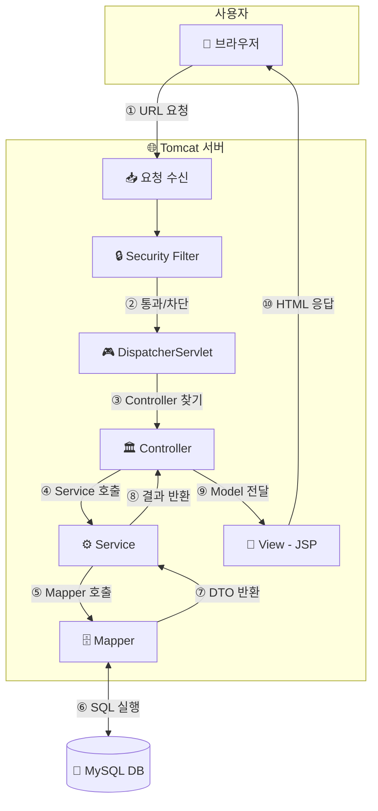

---

## 2. MVC 레이어 구조

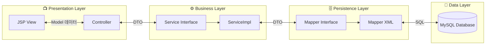

---

## 3. 회원가입 흐름

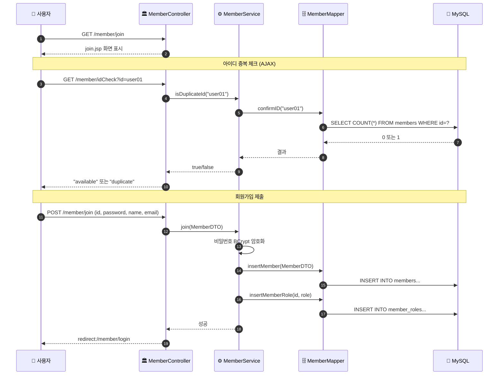

---

## 4. 로그인 흐름 (Spring Security)

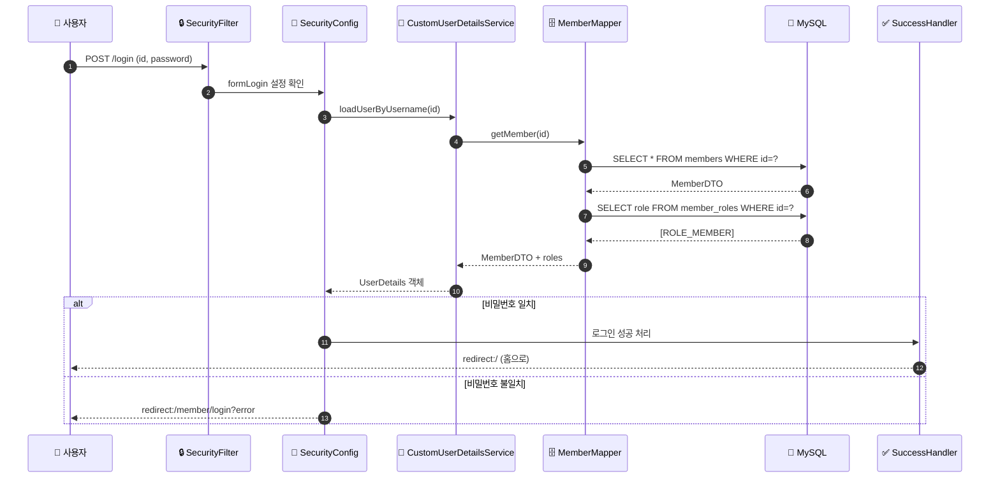

---

## 5. 게시글 CRUD 흐름

### 5.1 게시글 목록 조회 (페이징)

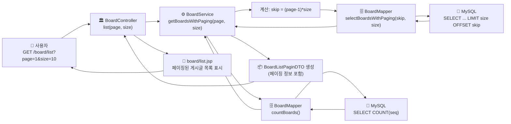

### 5.2 게시글 상세 조회 (조회수 증가 포함)

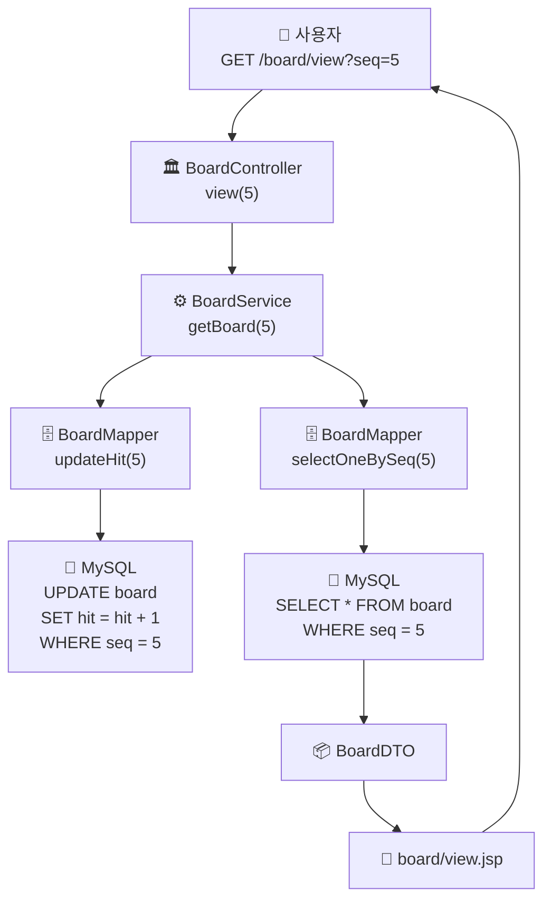

### 5.3 게시글 작성

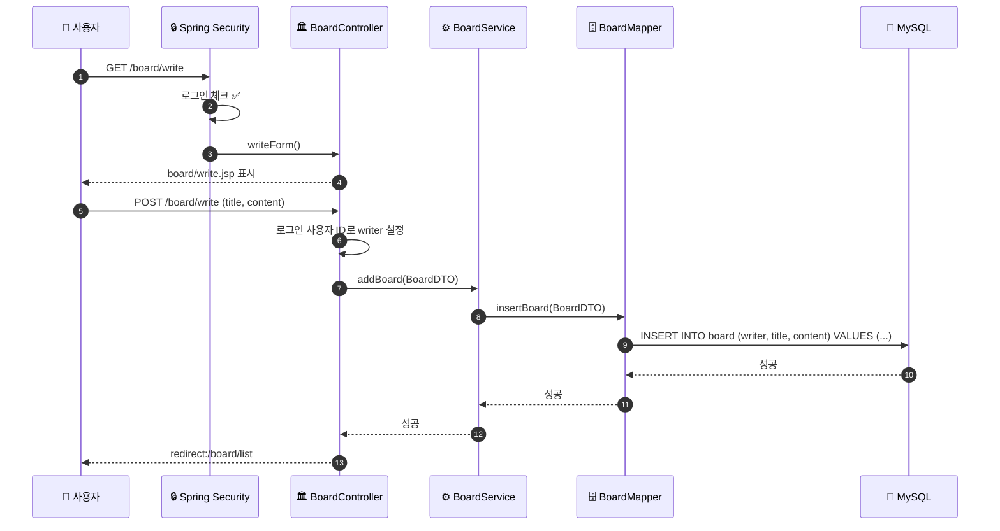

### 5.4 게시글 수정

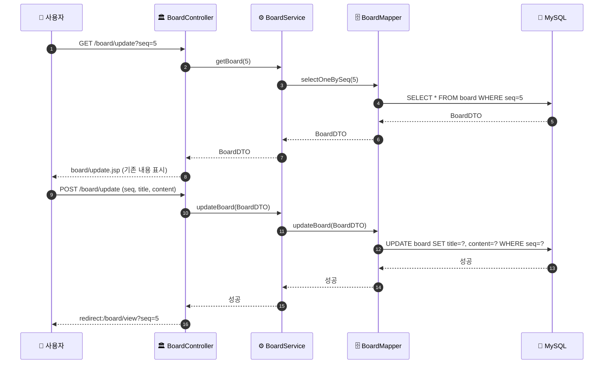

### 5.5 게시글 삭제 (논리적 삭제)

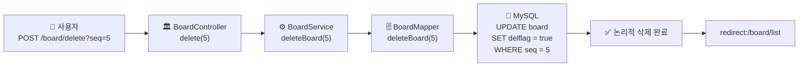

---

## 6. 접근 권한 제어 흐름

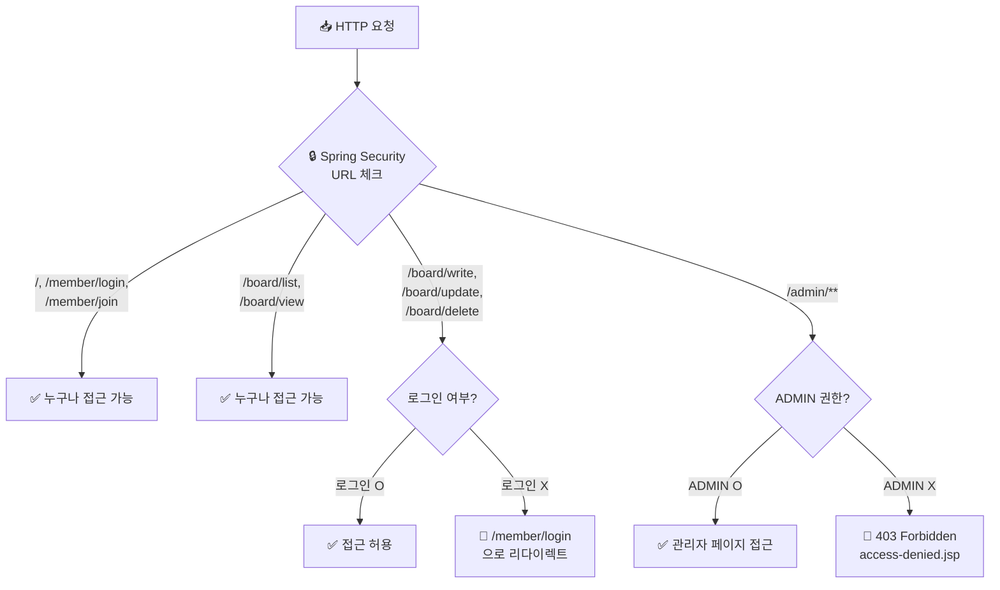

---

## 7. 데이터베이스 ERD

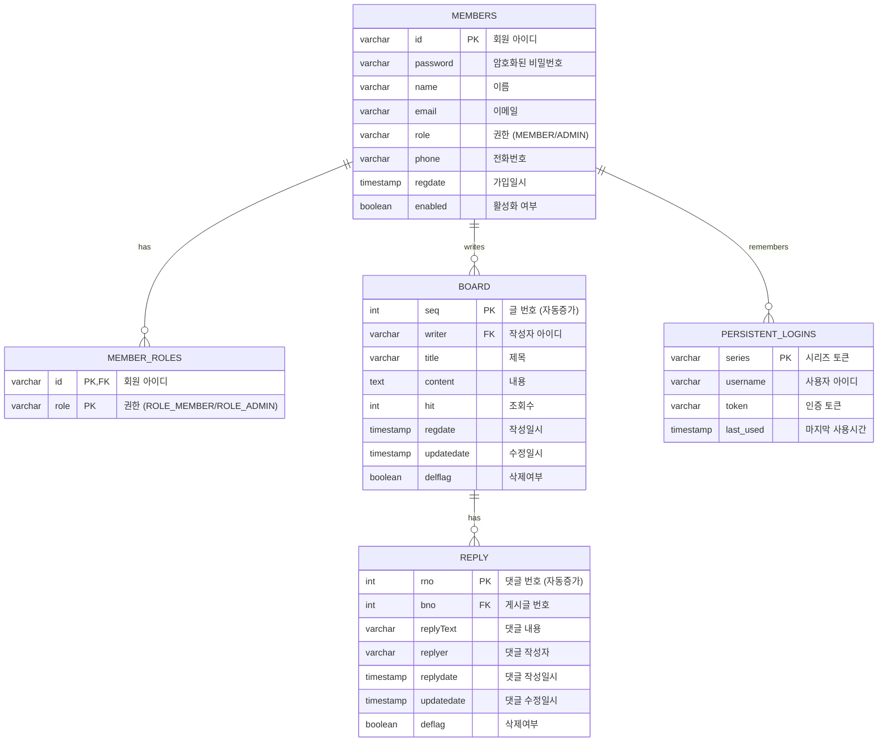

---

## 8. 데이터 흐름 (요청 → 응답)

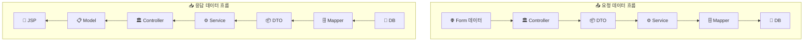

---

## 9. Spring Security 인증 상태 다이어그램

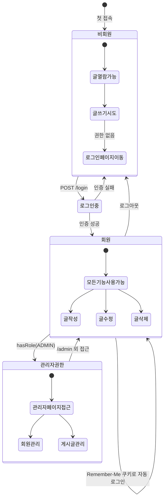

---

## 10. 프로젝트 폴더 구조

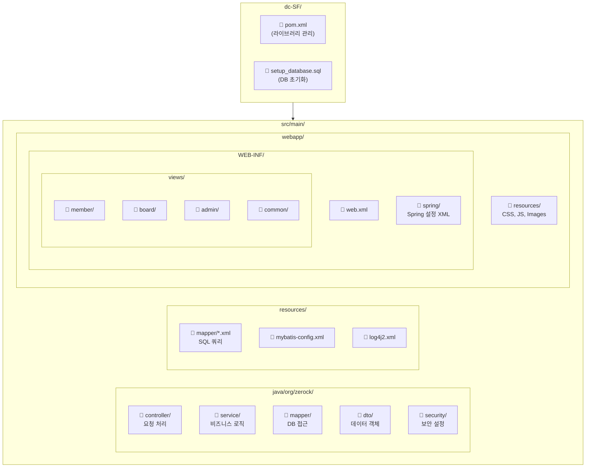

---

## 11. 관리자 기능 흐름

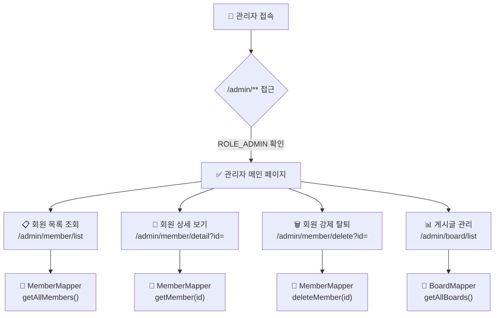

---

## 12. 댓글 CRUD 흐름

### 12.1 댓글 등록

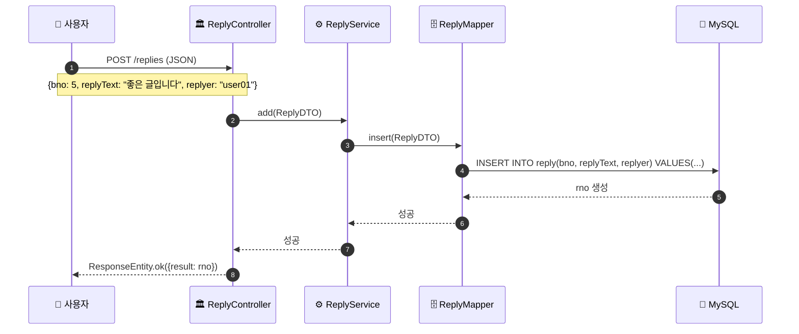

### 12.2 댓글 목록 조회 (페이징)

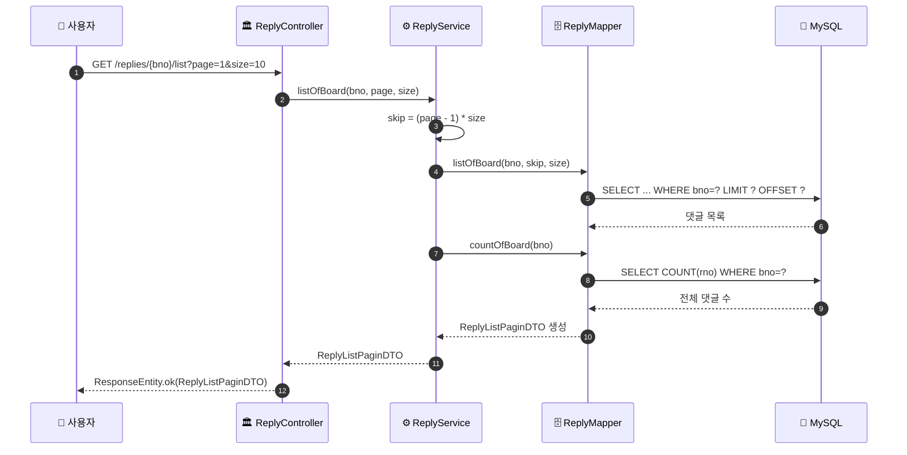

### 12.3 댓글 수정/삭제

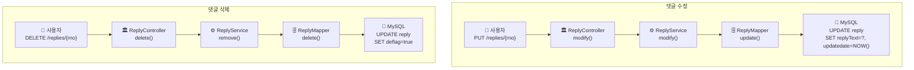

---

## 13. 페이징 처리 흐름

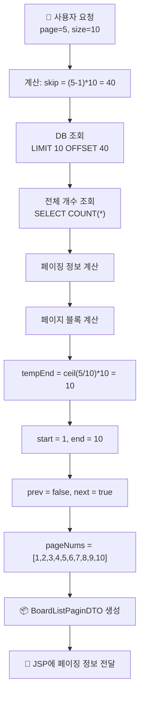

---

## 14. 의존성 주입 (DI) 흐름

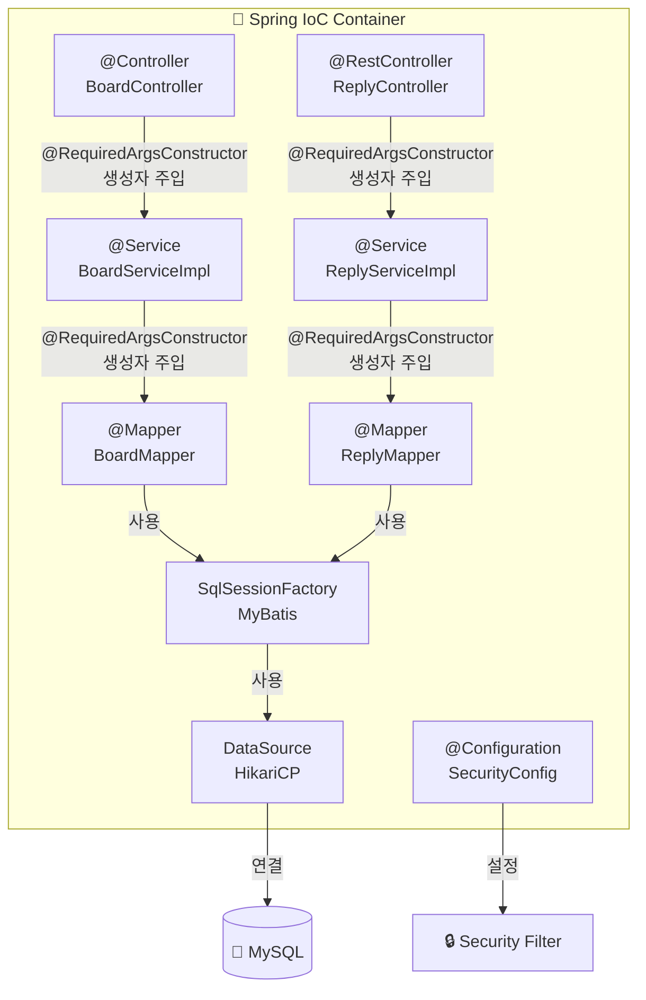

---

## 🎉 문서 완료

이 Mermaid 다이어그램들을 통해 **대철이제철 게시판** 프로젝트의 전체적인 구조와 흐름을 시각적으로 이해할 수 있습니다.

### 포함된 다이어그램

1. 전체 요청 처리 흐름
2. MVC 레이어 구조
3. 회원가입 흐름
4. 로그인 흐름 (Spring Security)
5. 게시글 CRUD (목록/조회/작성/수정/삭제) - 페이징 포함
6. 접근 권한 제어 흐름
7. 데이터베이스 ERD (댓글 테이블 포함)
8. 데이터 흐름
9. Spring Security 인증 상태
10. 프로젝트 폴더 구조
11. 관리자 기능 흐름
12. 댓글 CRUD 흐름 (등록/목록/수정/삭제, 페이징 포함)
13. 페이징 처리 흐름
14. 의존성 주입 (DI) 흐름
