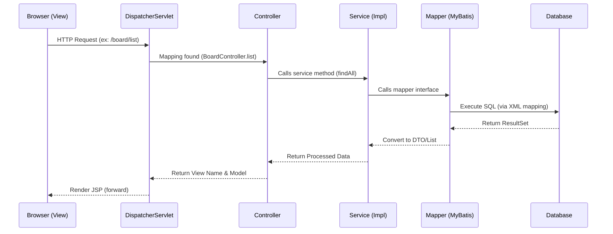

# Architecture & Data Flow

이 문서는 `dc-sf-spring` 프로젝트의 계층형 아키텍처와 요청 처리 흐름을 설명합니다.

## 1. Spring MVC Architecture
프로젝트는 전형적인 Spring Web MVC 구조를 따릅니다.

- **Presentation Layer**: `Controller` (`BoardController`)
- **Business Layer**: `Service` (`BoardService`, `BoardServiceImpl`)
- **Persistence Layer**: `Mapper` (`BoardMapper`, `BoardMapper.xml`)
- **Domain Objects**: `DTO` (`BoardDTO`, `MemberDTO`)

## 2. Request Data Flow (Sequential)

## 3. 계층별 역할 설명

### [Controller] - `org.zerock.controller`
- 사용자의 요청을 수신하고 입력 파라미터를 검증합니다.
- 비즈니스 로직(Service)을 호출하고 결과를 `Model` 객체에 담아 View로 전달합니다.
- 어떤 View(JSP)를 보여줄지 결정합니다.

### [Service] - `org.zerock.service`
- 비즈니스 로직을 처리하는 핵심 계층입니다.
- 여러 Mapper를 조합하거나 복잡한 계산을 수행합니다.
- 트랜잭션(`@Transactional`) 관리의 단위가 됩니다.

### [Mapper (DAO)] - `org.zerock.mapper`
- 데이터베이스에 직접 접근하는 인터페이스입니다.
- MyBatis 어노테이션이나 XML 파일을 통해 SQL 쿼리를 실행합니다.
- DB 결과를 객체(DTO)로 매핑합니다.

### [DTO] - `org.zerock.dto`
- 각 계층 간에 데이터를 주고받기 위한 객체입니다.
- 단순 변수와 Getter/Setter(또는 Lombok)로 구성됩니다.
