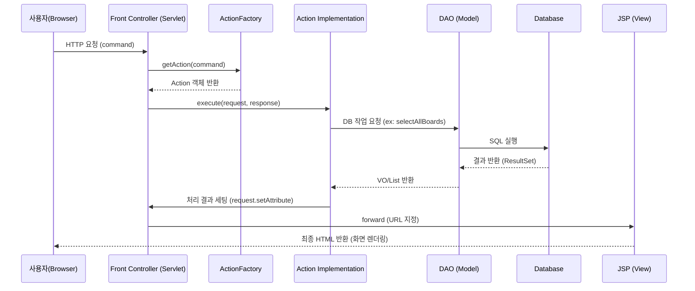

# Board Project Structure & Interaction Guide

이 문서는 `board-project`의 전체적인 구조, 설계 패턴, 그리고 각 컴포넌트 간의 상호작용을 이해하기 위해 작성되었습니다.

---

## 1. 프로젝트 개요 (Overview)
본 프로젝트는 **Java Servlet/JSP** 기술을 기반으로 하며, **MVC (Model-View-Controller) 아키텍처**와 **커맨드 패턴(Command Pattern)**을 적용하여 유지보수성과 확장성을 높인 웹 애플리케이션입니다.

- **Backend**: Java 8+, Servlet, JSP
- **Database**: JDBC (MySQL/Oracle 계열 사용 가능)
- **Architecture**: MVC Model 2 Architecture

---

## 2. 전체 디렉토리 구조 (Directory Structure)

```text
board-project/
├── src/main/java/                     # Java 소스 코드
│   ├── com.saeyan.controller/         # 서블릿 및 컨트롤러 관련 로직
│   │   ├── ActionFactory.java         # 커맨드(Action) 인스턴스 생성 팩토리
│   │   ├── MemberServlet.java         # 회원 관련 Front Controller
│   │   ├── BoardServlet.java          # 게시판 관련 Front Controller
│   │   └── AdminServlet.java          # 관리자 관련 Front Controller
│   │   └── action/                    # 각 기능별 Action 인터페이스 및 구현체
│   │       ├── Action.java            # 공통 Action 인터페이스
│   │       ├── member/                # 로그인, 회원가입, 수정 등
│   │       ├── board/                 # 목록, 상세, 쓰기, 수정, 삭제 등
│   │       └── admin/                 # 관리 권한 관련 로직
│   ├── com.saeyan.dao/                # Data Access Object (DB 접근 로직)
│   │   ├── MemberDAO.java             # 회원 DB 처리 (Singleton)
│   │   └── BoardDAO.java              # 게시판 DB 처리 (Singleton)
│   ├── com.saeyan.dto/                # Data Transfer Object (데이터 객체)
│   │   ├── MemberVO.java              # 회원 데이터 모델 (Value Object)
│   │   └── BoardVO.java               # 게시판 데이터 모델 (Value Object)
│   └── util/                          # 유틸리티 클래스
│       └── DBManager.java             # 커넥션 획득 및 자원 해제 공통 클래스
├── src/main/webapp/                   # 웹 자원 (View, Static Assets)
│   ├── WEB-INF/                       # 환경 설정 및 설정 파일
│   │   └── web.xml                    # 서블릿 매핑 및 환경 설정
│   ├── board/                         # 게시판 관련 JSP (list, view, write...)
│   ├── member/                        # 회원 관련 JSP (join, login, update...)
│   ├── admin/                         # 관리자 관련 JSP
│   ├── common/                        # 공통 디자인 (header, footer, menu)
│   ├── css/                           # 스타일시트 (style.css)
│   ├── script/                        # 클라이언트 스크립트 (javascript)
│   ├── images/                        # 이미지 자원
│   ├── index.jsp                      # 시작 페이지
│   └── error.jsp                      # 에러 처리 페이지
└── target/                            # 빌드 산출물
```

---

## 3. MVC 아키텍처 및 데이터 흐름

### 3.1. 기본 상호작용 흐름 (Request Lifecycle)

전체적인 요청 처리는 다음과 같은 순서로 진행됩니다:

1.  **Request (View)**: 사용자가 브라우저에서 버튼 클릭 또는 URL 요청 (예: `BoardServlet?command=board_list`).
2.  **Dispatch (Controller)**: `Front Controller(Servlet)`가 요청을 수신.
3.  **Command Execution (Action)**: `ActionFactory`를 통해 적절한 `Action` 구현체를 찾아 `execute()` 실행.
4.  **Data Processing (Model)**: `Action` 내에서 `DAO`를 호출하여 DB 작업을 수행하고, 결과 데이터를 `VO` 객체에 담아 반환.
5.  **Data Storage (Request/Session)**: 처리 결과를 `request.setAttribute()` 등을 통해 저장.
6.  **Forward (View)**: 적절한 `JSP` 페이지로 포워딩되어 화면에 데이터를 출력.

### 3.2. 시퀀스 다이어그램 (Sequence Diagram)



---

## 4. 핵심 설계 및 디자인 패턴

### 4.1. 커맨드 패턴 (Command Pattern)
- **적용**: `Action` 인터페이스와 그 구현체들.
- **장점**: 서블릿이 비대해지는 것을 방지하고, 각 기능을 독립적인 클래스로 분리하여 유지보수성을 극대화합니다. `ActionFactory`에서 `if-else` 또는 `Map`을 통해 요청별 처리를 매칭합니다.

### 4.2. 싱글톤 패턴 (Singleton Pattern)
- **적용**: `DAO` 클래스 (`BoardDAO`, `MemberDAO`), `ActionFactory`.
- **장점**: 인스턴스를 단 하나만 생성하여 시스템 전체에서 공유함으로써 메모리 낭비를 줄이고 데이터 접근의 효율성을 높입니다.

### 4.3. Front Controller 패턴
- **적용**: `BoardServlet`, `MemberServlet`, `AdminServlet`.
- **장점**: 모든 요청을 한곳에서 중앙 제어하여 공통 로직(인코딩, 세션 체크 등)을 일관되게 처리할 수 있습니다.

---

## 5. 컴포넌트 간 관계 (Relationship)

### [View] ↔ [Controller]
- JSP는 폼 데이터를 서블릿으로 전송하고, 서블릿은 처리 결과를 JSP로 전달하며 화면 제어권을 위임(Forward)합니다.

### [Controller] ↔ [Model]
- Action 클래스는 로직 처리를 위해 DAO에 의존하며, DAO는 데이터 전송을 위해 VO(DTO) 객체를 매개체로 사용합니다.

### [Model] ↔ [Database]
- DAO는 DBManager를 통해 DB 커넥션을 획득하고 SQL을 실행하여 데이터를 영구 저장하거나 조회합니다.
